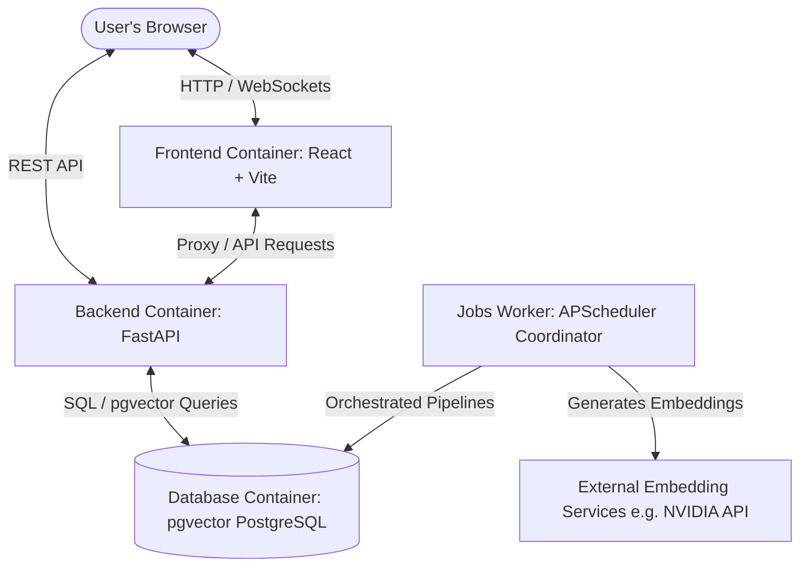

# SignalFeed 📡

SignalFeed is a premium, intelligent media and RSS aggregation platform with semantic vector discovery. It automates the extraction, transcription, chunking, and vector embedding of RSS feeds and YouTube channels, giving users a personalized recommendation feed with a dynamic clickbait scoring system.

---

## 🚀 Key Features

*   **Interactive Snapping Curation Dial**:
    *   **Tactile Circular Dial**: Features a touch-sensitive, circular dragging thermostat dial to adjust serendipity levels in real-time, removing manual `+` and `-` buttons completely.
    *   **Tactile Level Snapping**: Automatically maps drag angles to 4 snap curation levels (Conservative: 5%, Balanced: 20%, High Discovery: 40%, Serendipitous: 60%).
    *   **Perfect Layering**: Engineered with un-rotated SVG coordinate math and layered at `zIndex: 30` to float the circular knob and progress arc cleanly on top of the dial face boundaries.
*   **Auto-Extracting Channel Subscriptions**:
    *   **Compact Single-Row Form**: Replaced standard multi-field nickname forms with a single compact input accepting YouTube channel URLs, handle-based `@` URLs, or raw channel IDs.
    *   **Background URL Metadata Resolver**: The backend scrapes YouTube canonical links directly in under a second (with robust failover sweeps to public Invidious searches) to extract the official channel ID, title, and channel avatar icon completely in the background.
*   **Telemetry-Driven Feed Curation**:
    *   **Permanent UI Exclusion**: When a user clicks `✕` (Skip) or "Dislike", the telemetry event is logged, and the backend permanently excludes these videos from candidate lists so they never reappear across refreshes.
    *   **Exploration Constraints**: Implemented a $\ge 0.35$ cosine similarity constraint on the `queue_adjacent` candidates bucket, preventing low-signal out-of-network content (like stand-up comedy) from drifting into unrelated watchlist topics (like gospel music or programming).
*   **Dual-Stage Recommendation Engine**:
    *   **Stage 1 (Multi-Bucket Retrieval)**: Fast retrieval of content candidates based on subscribed channels, queue adjacency, and followed interests.
    *   **Stage 2 (Diversity Reranking)**: Employs multi-dimensional linear scoring including semantic affinity, clickbait penalization, chronological freshness decay, and active telemetry weight tuning.
*   **Premium Interactive React UI**:
    *   **Active Learning Dashboard**: A premium, full-screen YouTube-style Curation Vector Dashboard for followed topics and seeds, supporting automatic URL video seeding metadata queries.
    *   **Card Entry Animations**: Structured with `@keyframes fadeIn` transitions on visual grid tiles so new recommendations glide and fade elegantly into place upon snaps or page refreshes.
    *   **Persistency**: Theme configurations and sidebar panel states (Left Curation & Right Watchlist) are synchronized directly to local storage to survive browser refreshes.

---

## 🏗️ Architecture Overview

The system is composed of four main Docker containers cooperating on a local network:



### Component Breakdown
1.  **`db`**: PostgreSQL 16 server pre-configured with the `pgvector` extension to store channel/video metadata and high-dimensional semantic embeddings.
2.  **`backend`**: FastAPI application exposing the REST endpoints and performing real-time candidate retrieval, interest vector queries, and scoring evaluations.
3.  **`jobs-worker`**: An asynchronous background service running on `apscheduler` that continuously processes raw feed syncs, video transcripts, chunking, vector embedding generation, and telemetry-based database pruning.
4.  **`frontend`**: Single Page Application built on React 19 and Vite.

---

## 🛠️ Prerequisites

To run this project locally, ensure you have:
*   [Docker](https://docs.docker.com/get-docker/) installed.
*   [Docker Compose](https://docs.docker.com/compose/install/) installed.
*   An active **NVIDIA API Key** (or another configured embedding provider credentials) if you wish to run vector embeddings.

---

## ⚡ Getting Started (Docker Compose)

The entire application can be run seamlessly with a single command via Docker Compose.

### 1. Setup Environment Variables
Create a `.env` file in the root directory (alongside `docker-compose.yml`) to store your API credentials and service configurations:

```env
# NVIDIA API Credentials
NVIDIA_API_EMBEDDING=your_nvidia_embedding_api_key_here
NVIDIA_API_KEY1=your_nvidia_model_api_key_here

# Vector Configurations (Optional - defaults already defined in docker-compose)
EMBEDDING_DIM=2048
EMBEDDING_MODEL=nvidia/llama-nemotron-embed-vl-1b-v2
```

### 2. Start the Application
Run the following command in the root directory to build and boot the services in detached (background) mode:

```bash
docker compose up -d --build
```

*(Note: Depending on your system configuration, you might need to run `docker-compose up -d --build` if you are using older docker compose versions.)*

### 3. Verify Services are Running
You can check the running containers with:
```bash
docker compose ps
```

To tail the logs of all containers, run:
```bash
docker compose logs -f
```

---

## 🌐 Accessing the Services

Once started, the following local services are exposed:

| Service | Address | Description |
| :--- | :--- | :--- |
| **Frontend** | [http://localhost:5173](http://localhost:5173) | Interactive React Web Application Dashboard |
| **Backend REST API** | [http://localhost:8000](http://localhost:8000) | FastAPI Swagger UI Docs |
| **API Endpoints** | [http://localhost:8000/api](http://localhost:8000/api) | Prefix for all modular API routers |
| **Interactive Docs** | [http://localhost:8000/docs](http://localhost:8000/docs) | Interactive Swagger UI API playground |
| **Database** | `localhost:5432` | PostgreSQL + pgvector connection |

> **PostgreSQL Connection Settings:**
> *   **Host**: `localhost`
> *   **Port**: `5432`
> *   **Username**: `feed_user`
> *   **Password**: `feed_password`
> *   **Database**: `feed_db`

---

## 🛠️ Useful Operations & Commands

### Manual Pipeline Sync Trigger
By default, the background jobs worker scans for fresh feeds every **10 minutes**. You can trigger an immediate, out-of-band sequential sweep across all pipeline jobs (Ingestion ➡️ Chunking ➡️ Embedding) by sending a POST request to the debug endpoint:

```bash
curl -X POST http://localhost:8000/api/debug/pipeline/run
```

### Database Curation & Telemetry Auto-Tune
The scheduler executes database maintenance and auto-tunes interest weights based on events telemetry every **60 minutes**. This prunes expired unseen records and synchronizes your vector profile.

### View Specific Container Logs
*   **FastAPI Backend logs**:
    ```bash
    docker compose logs -f backend
    ```
*   **Jobs Worker Pipeline logs**:
    ```bash
    docker compose logs -f jobs-worker
    ```
*   **Database logs**:
    ```bash
    docker compose logs -f db
    ```

### Re-initializing Database Tables
The backend auto-initializes the PostgreSQL database and tables when starting up by applying:
```sql
CREATE EXTENSION IF NOT EXISTS vector;
```
If you make modifications to the SQLAlchemy models in `backend/app/models.py`, you can recreate the containers by running:
```bash
docker compose down -v
docker compose up -d --build
```
> [!CAUTION]
> The `-v` flag will delete the persistent PostgreSQL volume `db_data`, erasing all local channels, videos, interest models, and historical watch events.

---

## 📡 REST API Structure

The backend application provides modular routers nested under the `/api` prefix:

*   📂 `/api/channels` - Add, edit, list, and configure channels/RSS feeds.
*   📂 `/api/feed` - Fetch candidate recommendations filtered through the multi-stage reranker.
*   📂 `/api/queue` - Manage users' read/watch queues (add, complete, reorder items).
*   📂 `/api/search` - Execute hybrid semantic and lexical keyword queries.
*   📂 `/api/interests` - Configure customized semantic topics weights.
*   📂 `/api/debug` - Diagnostic sandboxes (e.g., scoring explanation, telemetry logging).

---

## ⚙️ Environment Configuration Reference

The following settings are configurable inside `backend/app/config.py` and can be overridden using variables in your `.env` file:

| Variable | Type | Default Value | Description |
| :--- | :--- | :--- | :--- |
| `PROJECT_NAME` | String | `SignalFeed` | Application title display |
| `DATABASE_URL` | String | `postgresql://feed_user:feed_password@db:5432/feed_db` | Connection string for database |
| `EMBEDDING_PROVIDER` | String | `nvidia` | Vector engine provider |
| `EMBEDDING_MODEL` | String | `nvidia/llama-nemotron-embed-vl-1b-v2` | Nvidia Nemotron Embedding Model |
| `EMBEDDING_DIM` | Integer | `2048` | Dimension size bound to pgvector |
| `DEFAULT_POLLING_INTERVAL_MINS` | Integer | `360` | Default channel sync cycle |
| `DISCOVERY_RATIO_TARGET` | Float | `0.20` | Dynamic serendipitous/discovery ratio target |
| `OLLAMA_BASE_URL` | String | `http://ollama:11434` | Endpoint for Ollama summaries fallback |
| `OLLAMA_SUMMARY_MODEL` | String | `llama3` | Ollama summary model target |
